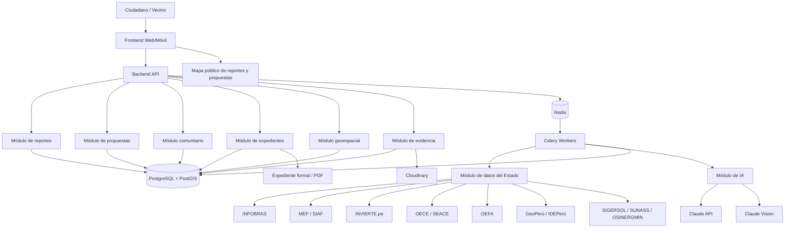
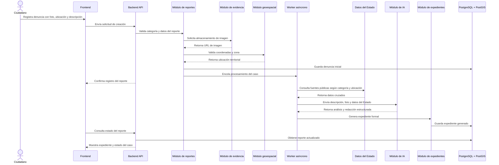
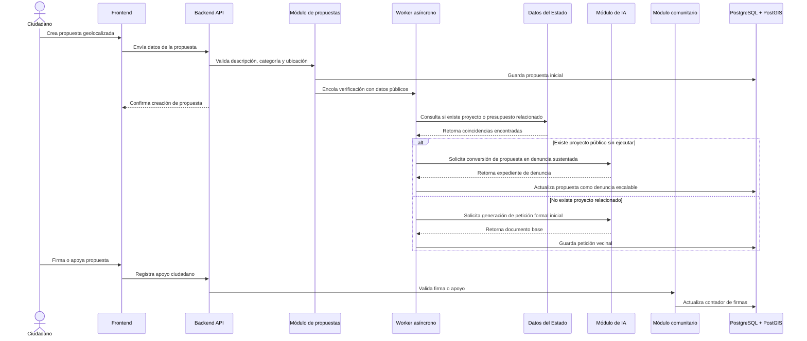
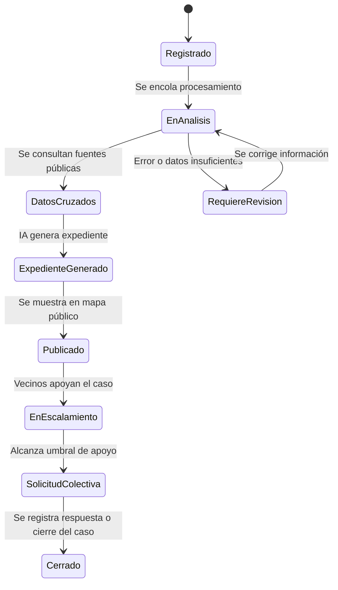
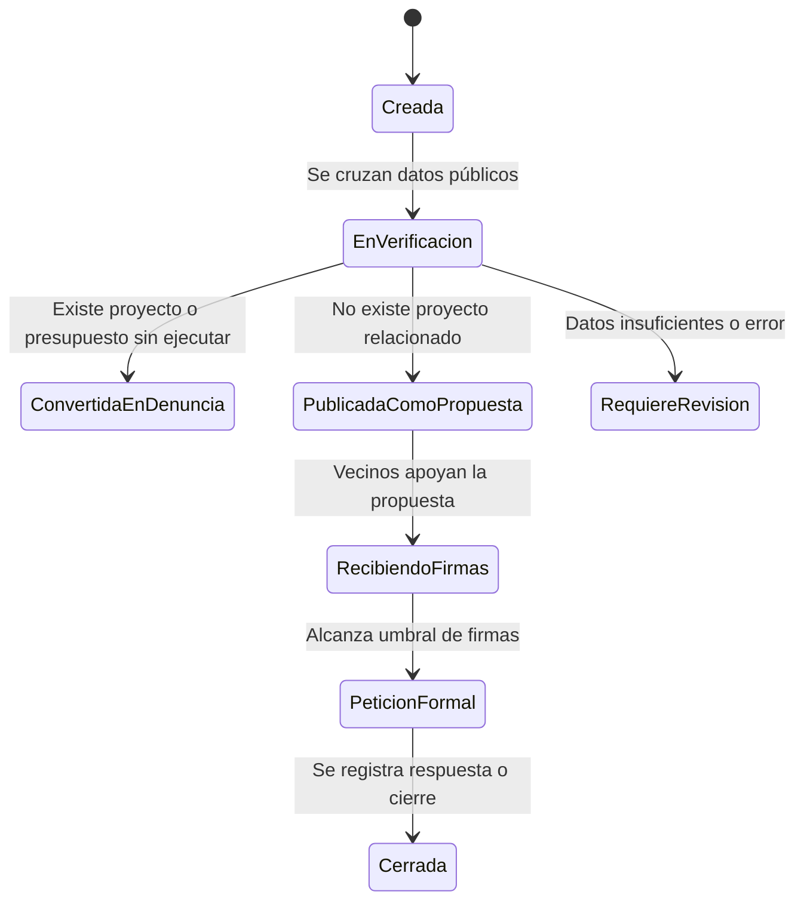

# Módulos principales del sistema - ReportaP'

## Descripción general

ReportaP' se divide en módulos funcionales que permiten registrar denuncias y propuestas ciudadanas, cruzarlas con datos públicos del Estado peruano, generar expedientes formales con IA y publicarlas en un mapa para que otros vecinos puedan apoyar o escalar el caso.

## Módulos del sistema

| Módulo | Responsabilidad | Se comunica con |
|---|---|---|
| Frontend Web/Móvil | Interfaz para ciudadanos. Permite registrar reportes, propuestas, fotos, ubicación GPS, visualizar el mapa y apoyar casos existentes. | Backend API |
| Backend API | Expone los endpoints principales, valida solicitudes, coordina reglas de negocio y conecta los módulos internos. | Frontend, base de datos, Cloudinary, Redis |
| Módulo de reportes | Gestiona denuncias ciudadanas, categorías, descripción, estado, ubicación y evidencia. | Backend API, PostGIS, Cloudinary, Workers |
| Módulo de propuestas | Gestiona iniciativas vecinales geolocalizadas y permite convertir propuestas en denuncias si existen proyectos públicos sin ejecutar. | Backend API, PostGIS, Workers, módulo comunitario |
| Módulo geoespacial | Procesa coordenadas, puntos en mapa, zonas territoriales y entidad responsable según ubicación. | PostGIS, GeoPerú / IDEPerú |
| Módulo de evidencia | Administra imágenes subidas por ciudadanos y evidencia adicional de vecinos. | Cloudinary, Backend API, base de datos |
| Módulo de datos del Estado | Consulta y cruza información pública de fuentes como INFOBRAS, MEF, INVIERTE.pe, OEFA, SEACE, GeoPerú, SIGERSOL, SUNASS y OSINERGMIN. | Workers, fuentes externas del Estado |
| Módulo de IA | Analiza descripción, foto y datos públicos para clasificar el caso y generar un expediente formal. | Claude API, Claude Vision, Workers |
| Módulo de expedientes | Estructura el reporte final con evidencia, entidad responsable, datos cruzados y acción sugerida. | IA, base de datos, Backend API |
| Módulo comunitario | Gestiona apoyos, firmas digitales, comentarios y evidencia adicional de vecinos. | Backend API, base de datos |
| Módulo de notificaciones / estado | Permite consultar el avance del reporte, estado del expediente y escalamiento comunitario. | Backend API, base de datos |
| Base de datos | Persiste usuarios, reportes, propuestas, firmas, evidencias, fuentes consultadas y expedientes generados. | Backend API, Workers |
| Workers asíncronos | Ejecutan tareas pesadas como consultas externas, análisis con IA y generación de expedientes sin bloquear al usuario. | Redis, IA, fuentes externas, base de datos |

## Diagrama de módulos

## Flujo principal de módulos - Denuncia ciudadana

## Flujo principal de módulos - Propuesta vecinal

## Comunicación con fuentes del Estado por categoría

| Categoría | Fuentes consultadas | Resultado esperado |
|---|---|---|
| Obra pública paralizada | INFOBRAS, MEF/SIAF, OECE/SEACE | Identificar obra registrada, presupuesto, avance, entidad y contratista |
| Proyecto sin ejecutar | INVIERTE.pe, MEF | Identificar proyecto aprobado, presupuesto asignado y entidad ejecutora |
| Contaminación / humo / ruido | OEFA, GeoPerú | Identificar antecedentes ambientales y entidad competente |
| Basura / botadero ilegal | SIGERSOL, MINAM, GeoPerú | Identificar municipalidad responsable y sustento normativo |
| Agua sin servicio | SUNASS, GeoPerú | Identificar EPS responsable y datos de calidad del servicio |
| Alumbrado roto | OSINERGMIN, GeoPerú | Identificar distribuidora eléctrica y competencia municipal |
| Pista / vereda rota | GeoPerú | Identificar municipalidad responsable de vías locales |
| Parque descuidado | GeoPerú | Identificar municipalidad responsable |
| Inseguridad / delincuencia | GeoPerú | Identificar PNP, serenazgo o municipalidad competente |
| Construcción ilegal | GeoPerú | Identificar municipalidad responsable de licencias y fiscalización |

## Estados principales de un reporte

## Estados principales de una propuesta

## Reglas iniciales de negocio

- Una denuncia debe contener como mínimo descripción, categoría, ubicación y evidencia fotográfica.
- Una propuesta debe contener descripción, ubicación y categoría de intervención.
- Todo reporte o propuesta debe asociarse a coordenadas geográficas.
- El sistema debe identificar la entidad responsable según ubicación y categoría.
- El análisis con IA se ejecuta de forma asíncrona para no bloquear al usuario.
- Los expedientes se generan usando la descripción ciudadana, evidencia fotográfica y datos cruzados del Estado.
- Las propuestas pueden convertirse en denuncias si se encuentra un proyecto público aprobado o presupuesto asignado sin ejecución.
- Los reportes pueden escalar a solicitud colectiva cuando alcanzan un umbral mínimo de apoyo ciudadano.
- El mapa público muestra reportes, propuestas y estados relevantes para fomentar participación vecinal.
